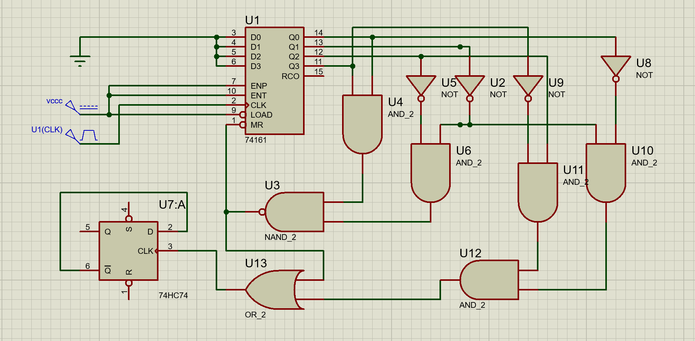

| Q D | Q C | Q B  | Q A  | BACK_SIT                 |
| ----------------------- | ----------------------- | ----------------------- | ----------------------- | ------------------------ |
| 0                       | 0                       | 0                       | 0                       | IN                       |
| 0                       | 0                       | 0                       | 1                       |                          |
| 0                       | 0                       | 1                       | 0                       |                          |
| 0                       | 0                       | 1                       | 1                       |                          |
| 0                       | 1                       | 0                       | 0                       |                          |
| 0                       | 1                       | 0                       | 1                       |                          |
| 0                       | 1                       | 1                       | 0                       |                          |
| 0                       | 1                       | 1                       | 1                       |                          |
| 1                       | 0                       | 0                       | 0                       |                          |
| 1                       | 0                       | 0                       | 1                       |               TO (LD=0)           |

###### 产生矩形脉冲(50%)?
可以试试反D触发器在0100与1001处触发

最终设计:
