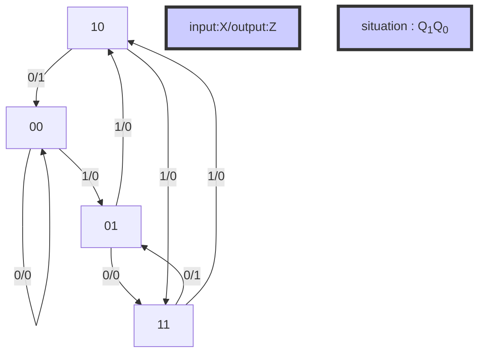

# 易得该电路为Mealy型号

## 状态转移函数

 Q ``n+1 ``=$J\cdot \overline{Q_{}^{n}} +\overline{K} \cdot Q_{}^{n}$   |(原始JK触发器)

$Q_{0}^{n+1}=X\cdot \overline{Q_{0}^{n}}+\overline{X} \cdot Q_{0}^{n}$

$Q_{1}^{n+1}=Q_{0}\cdot \overline{Q_{1}^{n}}+{X} \cdot Q_{1}^{n}$

## 输出函数

$Z=Q_{1} \cdot \overline{X} $

## 状态表

<table>
  <thead>
    <tr>
      <th rowspan="2"></th> <!-- 将“列一”扩展到两行 -->
      <th colspan="2">Q1n+1 Q0n+1/Z</th>
    </tr>
    <tr>
      <td>X:0</td> <!-- 原来的“行1列1”被合并到“列一” -->
      <td>X:1</td>
    </tr>
  </thead>
  <tbody>
    <tr>
      <td>Q1 Q0 : 00</td>
      <td>00/0</td>
      <td>01/0</td>
    </tr>
    <tr>
      <td>Q1 Q0 : 01</td>
      <td>11/0</td>
      <td>10/0</td>
    </tr>
    <tr>
      <td>Q1 Q0 : 11</td>
      <td>01/1</td>
      <td>10/0</td>
    </tr>
    <tr>
      <td>Q1 Q0 : 10</td>
      <td>00/1</td>
      <td>11/0</td>
    </tr>
  </tbody>
</table>

## 状态图

## 电路功能

 ??????????

