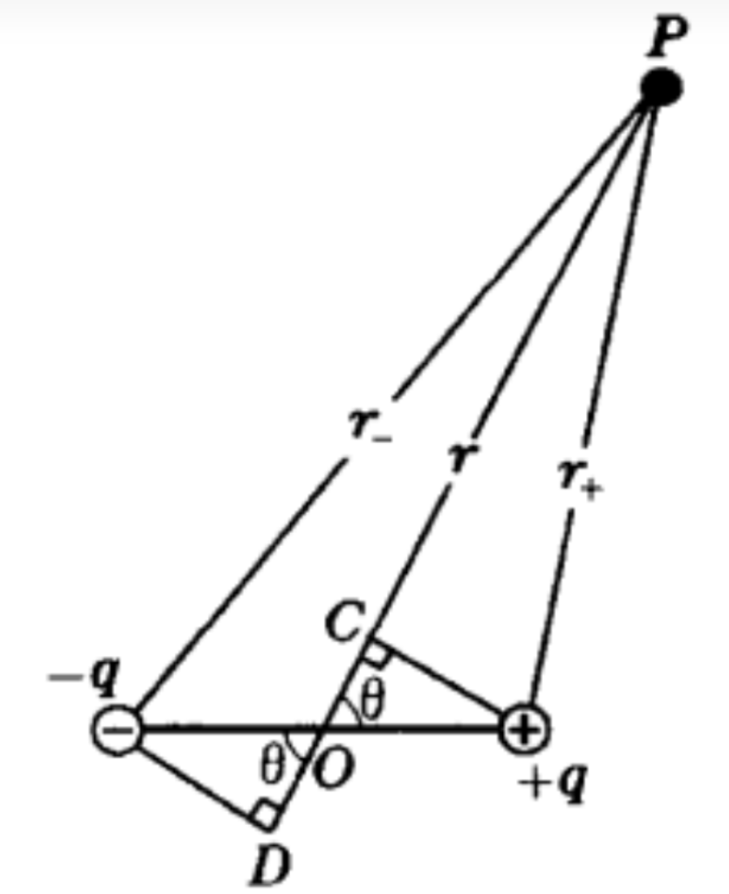

### 电偶极子电势
##### 对于远场电场而言:

$U=U_{+}+U_{-}=\frac{q}{4 \pi \epsilon_{0}}(\frac{1}{r_{+}}-\frac{1}{r_{-}})  $   ==[1]==
由几何关系:
$r_{+}\approx r-\frac{l}{2}\cos{\theta}$  ==[2]==
 $r_{+}\approx r-\frac{l}{2}\cos{\theta}$ ==[3]==

将[2][3]式带入[1]式得:
$U\approx \frac{1}{4\pi \epsilon_{0}}{}\frac{ql\cos{\theta}}{r_{}^{2}}=\frac{1}{4\pi \epsilon_{0}}{}\frac{p\cos{\theta}}{r_{}^{2}}$,其中p=ql
^(此时忽略l的平方项)^

<!-- 对于程序而言:
$r_{}^{2}=x^2+y^2+z^2$
即变形得:==$z=$== -->

